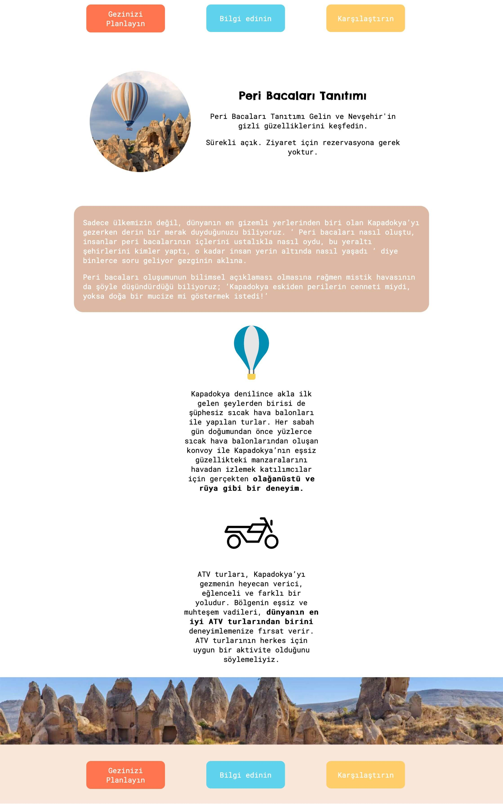

🎈 Kapadokya Turizm Platformu: AI Asistan ve Dijital Rezervasyon Entegrasyonu

🤖 Gelişmiş Özellikler ve Otomasyon (Yeni!)
Bu proje, statik bir web sitesinden dinamik bir hizmet platformuna dönüştürülmüştür. İçerisine entegre edilen modern araçlarla kullanıcı etkileşimi ve operasyonel verimlilik artırılmıştır:

Yapay Zeka Destekli Rehber (Chatbase): GPT tabanlı, site içeriğine hakim bir AI asistanı entegre edildi. Ziyaretçilerin Kapadokya ve turlar hakkındaki sorularını Türkçe ve İngilizce dillerinde yanıtlayabilen, kullanıcıyı doğrudan satış kanalına yönlendiren akıllı bir "Ajan" yapısı kuruldu.

Dijital Rezervasyon Sistemi (Calendly): Manuel randevu süreçlerini ortadan kaldıran, Google Takvim ile tam senkronize çalışan bir takvim entegrasyonu yapıldı. Kullanıcılar, müsaitlik durumuna göre anlık olarak Google Meet bağlantılı planlama görüşmeleri oluşturabilmektedir.

Dinamik Dil Desteği: Hem web sitesi yapısı hem de entegre AI asistanı, ziyaretçinin diline göre (TR/EN) duyarlı şekilde çalışacak şekilde optimize edildi.

📚 Bu Süreçte Ek Olarak Neler Öğrendim?
Statik CSS kurallarının ötesinde, bir mühendis olarak şu teknik yetkinlikleri pekiştirdim:

Üçüncü Parti API ve Widget Entegrasyonu: Harici sistemlerin (Calendly & Chatbase) mevcut bir web yapısına performans kaybı yaşatmadan nasıl gömüleceğini (Embed) deneyimledim.

Prompt Engineering (Yapay Zeka Yönergesi): Bir chatbot'un belirli bir işletme kimliğiyle (Professional Tour Guide) konuşmasını sağlayan sistem talimatlarının (System Prompt) kurgulanması.

İş Akışı Otomasyonu: Statik bir web sayfasının, yapay zeka ve takvim otomasyonu ile nasıl bir "SaaS" (Hizmet Olarak Yazılım) modeline dönüştürülebileceğinin mantığını kavradım.

Widget UI/UX Özelleştirme: Harici araçların renk ve stil ayarlarını, ana sitenin kurumsal renk kodlarına (#FF764E vb.) göre özelleştirerek tasarım bütünlüğünü koruma.

🔥 Güncel LIVE DEMO
Projenin yapay zeka ve rezervasyon sistemli canlı halini buradan inceleyebilirsiniz: [Kapadokya Gezini Planla](https://yavuzs-cakmak.github.io/KapadokyaGeziniPlanla/)

💡 Mühendislik Notu
Bu çalışma, sadece görsel bir tasarım değil; HTML/CSS temelleri, Yapay Zeka Entegrasyonu ve Kullanıcı Deneyimi (UX) süreçlerinin birleştiği hibrit bir projedir.

👨‍💻 Hazırlayan
Yavuz Selim Çakmak
## 📫 İletişim
cakmakselimfb58@gmail.com
LinkedIn: [Linkedin.com/in/yavuzscakmak](https://www.linkedin.com/in/yavuzscakmak/)
